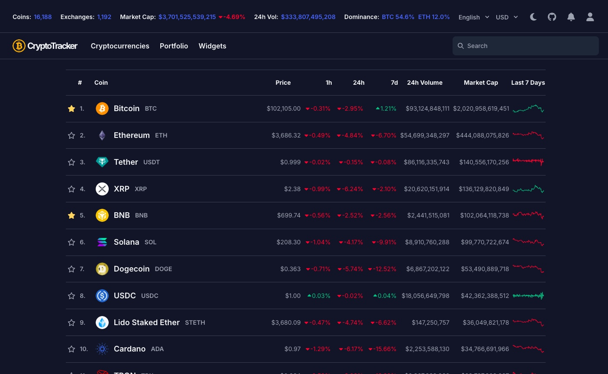

# CryptoTracker
#### All-in-One Cryptocurrency App

Cryptocurrency data for over 10,000 cryptocurrencies, Modeled after CoinMarketCap and CoinGecko, and using data from different APIs including CoinGecko, and Etherscan.



## Features
* Top 100 cryptocurrencies with real-time data
* Multiple pages for 10,000+ cryptocurrencies
* Personal portfolio tracker
* Variety of cryptocurrency widgets
* Clean, responsive interface

## Widgets
- Cryptocurrency Scrolling Marquee
- Cryptocurrency Cards
- Trending List
- Dominance Chart
- Ethereum Gas Tracker
- Crypto Fear & Greed Index

## Prerequisites
1. API Keys (free tiers available):
   * CoinGecko API account
     * [CoinGecko API](https://www.coingecko.com/en/api)
   * Etherscan API account
     * [Etherscan API](https://docs.etherscan.io/getting-started/viewing-api-usage-statistics) 

> 🎉 SPECIAL OFFER: Get 20% off ANY CoinGecko API Plan!\
> Valid on any monthly or annual plan: [View Plans](https://www.coingecko.com/en/api/pricing)\
> Use code `MENDOZA20` at checkout

## Setup
1. Clone the repository
   ```bash
   git clone https://github.com/yourusername/cryptotracker.git
   cd cryptotracker
   ```
2. Install dependencies
   ```bash
   npm install
   ```
3. Create a `.env` file in the root directory:
   ```env
   VITE_COINGECKO_DEMO_API_KEY="your_coingecko_api_key"
   VITE_ETHERSCAN_API_KEY="your_etherscan_api_key"
   ```
4. Start the development server
   ```bash
   npm run dev
   ```

## Project Structure
```
cryptotracker/
├── src/
│   ├── components/    # Reusable UI components
│   ├── contexts/      # React context providers
│   ├── data/          # Sample data files
│   ├── hooks/        # Custom React hooks
│   ├── pages/        # Main application pages
│   └── styles/       # Global styles
└── public/           # Static assets
```

## Environment Variables
| Variable | Description |
|----------|-------------|
| VITE_COINGECKO_DEMO_API_KEY | CoinGecko API key for retrieving crypto and global market data|
| VITE_ETHERSCAN_API_KEY | Etherscan API key for retrieving Ethereum gas data |

## Tech Stack
* React + Vite
* TypeScript
* TailwindCSS
* CoinGecko API
* Etherscan API

## Resources
- [CoinGecko](https://www.coingecko.com/)
- [CoinGecko API](https://www.coingecko.com/api/documentations/v3)
- [CoinMarketCap](https://coinmarketcap.com/)
- [Etherscan Gas Tracker](https://docs.etherscan.io/api-endpoints/gas-tracker)
- [Crypto Fear & Greed Index](https://alternative.me/crypto/fear-and-greed-index/)

## License
MIT

