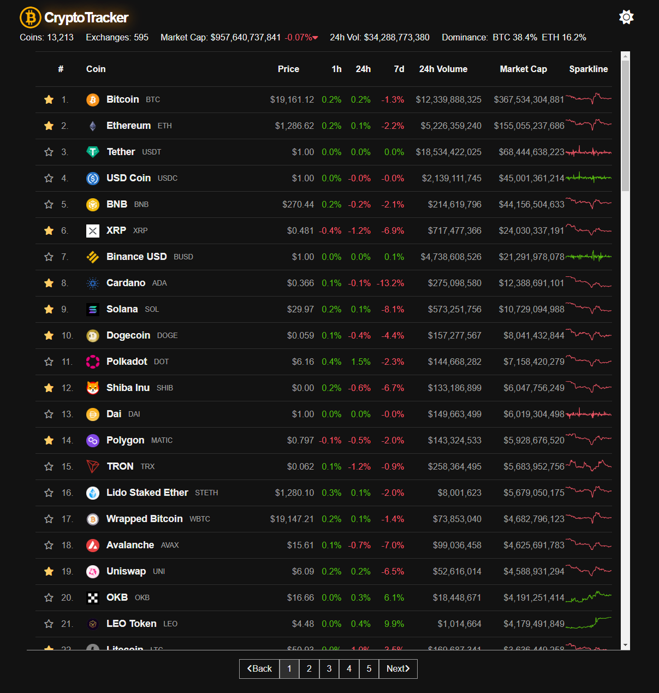

# CryptoTracker
## All-in-One Cryptocurrecy App
#### Cryptocurrency data for over 10,000 cryptocurrencies, Modeled after CoinMarketCap and CoinGecko, and using data from different APIs including CoinGecko, CryptoNews, and Etherscan. Research cryptocurrencies, track your portfolio, and find related news.
#### Built as a test to practice frontend development. Written mainly in React and deployed on Netlify with no backend.

## Main Features
- Cryptocurrency overview page
- Portfolio tracker
- Related news articles and videos (Not using an active API subscription)
- Cryptocurrency widgets

## Widgets
- Cryptocurrency Scrolling Marquee
- Cryptocurrency Cards
- Trending List
- Dominance Chart
- Ethereum Gas Tracker
- Crypto Fear & Greed Index

## Resources
- [CoinGecko](https://www.coingecko.com/)
- [CoinGecko API](https://www.coingecko.com/api/documentations/v3)
- [CoinMarketCap](https://coinmarketcap.com/)
- [Etherscan Gas Tracker](https://docs.etherscan.io/api-endpoints/gas-tracker)
- [Crypto Fear & Greed Index](https://alternative.me/crypto/fear-and-greed-index/)
- [CryptoNews API](https://cryptonews-api.com/)
